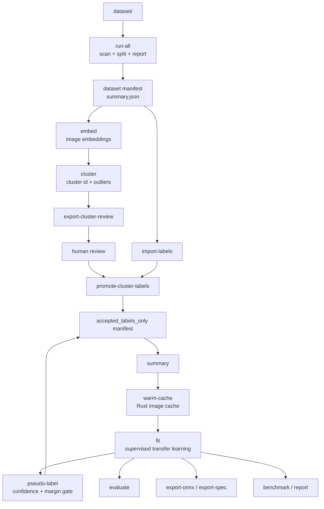

# Local Smart Waste Agent

`localagent` là phần lõi của dự án Smart Waste Sorting.

Hiện tại module này hỗ trợ:

- quét dataset ảnh thô trong `dataset/`
- tạo manifest Polars
- suy nhãn từ tên file
- phát hiện ảnh lỗi, ảnh quá nhỏ, ảnh trùng
- tạo split `train/val/test`
- xuất báo cáo dữ liệu
- warm cache ảnh bằng Rust để train nhanh hơn
- huấn luyện baseline trực tiếp từ manifest với progress bar

## Cấu trúc quan trọng

```text
localagent/
├── dataset/
├── datasets/
├── artifacts/
│   ├── manifests/
│   ├── reports/
│   ├── checkpoints/
│   └── cache/
├── models/
├── python/localagent/
├── src/
└── tests/
```

## Lệnh thường dùng

```powershell
cd localagent
uv sync --dev
uv run maturin develop
uv run python -m localagent.data.pipeline run-all
uv run python -m localagent.data.pipeline embed
uv run python -m localagent.data.pipeline cluster
uv run python -m localagent.data.pipeline export-cluster-review
# edit artifacts/manifests/cluster_review.csv before promoting labels
uv run python -m localagent.data.pipeline promote-cluster-labels --review-file artifacts/manifests/cluster_review.csv
uv run python -m localagent.data.pipeline export-labeling-template
uv run python -m localagent.data.pipeline import-labels --labels-file artifacts/manifests/labeling_template.csv
uv run python -m localagent.data.pipeline validate-labels
uv run python -m localagent.training.train summary
uv run python -m localagent.training.train warm-cache
uv run python -m localagent.training.train fit
uv run python -m localagent.training.train pseudo-label
uv run python -m localagent.training.train evaluate
uv run python -m localagent.training.train export-onnx
uv run python -m localagent.training.train export-spec
uv run python -m localagent.training.train benchmark
uv run python -m localagent.training.train compare-benchmarks --left-report artifacts/reports/baseline_benchmark.json --right-report artifacts/reports/rust_candidate_benchmark.json
uv run python -m localagent.training.train report
```

## Ba tầng pipeline đang có

### Sơ đồ ASCII

```text
dataset/
  |
  v
run-all
scan -> quality flags -> weak labels -> split
  |
  v
dataset_manifest.parquet + summary.json
  |
  +----------------------------+
  |                            |
  v                            v
embed                      import-labels
  |                            |
  v                            |
cluster                        |
  |                            |
  v                            |
export-cluster-review          |
  |                            |
  v                            |
human review ------------------+
  |
  v
promote-cluster-labels
  |
  v
accepted_labels_only manifest
  |
  v
summary -> warm-cache -> fit -> evaluate/export/report
                     |
                     v
                pseudo-label
                     |
                     v
             accepted pseudo labels
                     |
                     +-----> update manifest
```

### Sơ đồ Mermaid



### Legend nhãn

| Label type | Ý nghĩa | Dùng để train |
| --- | --- | --- |
| `weak label` | Nhãn yếu suy từ tên file hoặc cấu trúc tên ảnh; dùng làm tín hiệu khởi đầu khi chưa có curate labels. | Chỉ dùng tạm thời trước khi có accepted labels |
| `curated` | Nhãn đã được con người gán hoặc xác nhận trực tiếp qua import labels. | Có |
| `cluster_review` | Nhãn được người dùng chấp nhận ở mức cụm sau bước `embed -> cluster -> review`. | Có |
| `model_pseudo` | Nhãn do model đề xuất và chỉ được nhận khi vượt ngưỡng `confidence` và `margin`. | Có, nếu đã được accept qua pseudo-label gate |

### 1. Pipeline dữ liệu

Mục tiêu:

- quét ảnh thô trong `dataset/`
- suy nhãn từ tên file
- phát hiện ảnh lỗi, ảnh trùng, ảnh quá nhỏ
- chia `train/val/test`
- sinh manifest và báo cáo

Lệnh:

```powershell
cd localagent
uv run python -m localagent.data.pipeline run-all
```

Khi ảnh thô chưa có nhãn chuẩn, dùng thêm:

```powershell
uv run python -m localagent.data.pipeline export-labeling-template
uv run python -m localagent.data.pipeline import-labels --labels-file artifacts/manifests/labeling_template.csv
uv run python -m localagent.data.pipeline validate-labels
```

Đầu ra chính:

- `artifacts/manifests/dataset_manifest.parquet`
- `artifacts/manifests/dataset_manifest.csv`
- `artifacts/reports/summary.json`
- `artifacts/reports/split_summary.csv`
- `artifacts/reports/quality_summary.csv`
- `artifacts/reports/extension_summary.csv`
- `artifacts/reports/label_summary.csv`

### 2. Discovery và gán nhãn bán giám sát

Mục tiêu:

- không ép toàn bộ dataset phải có nhãn chuẩn ngay từ đầu
- dùng embedding thị giác để gom các ảnh giống nhau thành cụm
- review theo cụm để tăng tốc annotation
- chuyển dần từ nhãn yếu suy từ filename sang nhãn đã được chấp nhận

Lệnh:

```powershell
cd localagent
uv run python -m localagent.data.pipeline embed
uv run python -m localagent.data.pipeline cluster
uv run python -m localagent.data.pipeline export-cluster-review
# edit artifacts/manifests/cluster_review.csv
uv run python -m localagent.data.pipeline promote-cluster-labels --review-file artifacts/manifests/cluster_review.csv
```

Ý nghĩa học thuật:

- `embed` tạo không gian biểu diễn cho ảnh bằng backbone pretrained; nếu extractor pretrained không khả dụng thì hệ thống fallback sang đặc trưng thị giác thủ công để không làm vỡ pipeline.
- `cluster` gom cụm trong không gian embedding đã chuẩn hóa, từ đó sinh `cluster_id`, `cluster_distance`, `cluster_size`, `is_cluster_outlier`.
- `export-cluster-review` và `promote-cluster-labels` tạo một vòng human-in-the-loop: người dùng không phải gán nhãn từng ảnh một mà gán ở mức cụm.
- Khi manifest đã có `curated` hoặc `cluster_review`, trainer chuyển sang chế độ `accepted_labels_only`, tức là nhãn suy từ filename chỉ còn là weak hint chứ không còn được xem là ground truth để huấn luyện.

### 3. Pipeline huấn luyện

Mục tiêu:

- đọc manifest
- warm cache ảnh bằng Rust
- train classifier từ manifest đã được curate
- ghi checkpoint và labels

Lệnh:

```powershell
cd localagent
uv run python -m localagent.training.train summary
uv run python -m localagent.training.train warm-cache
uv run python -m localagent.training.train fit
uv run python -m localagent.training.train pseudo-label
uv run python -m localagent.training.train evaluate
uv run python -m localagent.training.train export-onnx
uv run python -m localagent.training.train export-spec
uv run python -m localagent.training.train benchmark
uv run python -m localagent.training.train report
```

### Kỹ thuật huấn luyện đang dùng

- Đây là pipeline transfer learning: các backbone CNN như `mobilenet_v3_small`, `mobilenet_v3_large`, `resnet18`, `efficientnet_b0` được fine-tune từ pretrained weights khi khả dụng.
- Mặc định trainer freeze backbone để giảm chi phí tối ưu trên CPU. Nếu muốn fine-tune toàn bộ feature extractor thì dùng `--train-backbone`.
- Bất cân bằng lớp được xử lý bằng weighted loss, weighted sampler hoặc cả hai thông qua `--class-bias loss|sampler|both`.
- `pseudo-label` là bước bán giám sát: model hiện tại suy nhãn cho các mẫu chưa được chấp nhận và chỉ nhận mẫu có `confidence` và `margin` đủ cao.
- Checkpoint `best` và `latest`, early stopping theo validation loss, resume training, evaluate, benchmark và export ONNX được thiết kế như một pipeline thực nghiệm thống nhất.
- Trong build hiện tại, `pytorch` là backend train thực sự. `rust_tch` vẫn đang ở trạng thái preview cho flow metadata như `export-spec` và benchmark contract, chưa thay thế lõi học sâu.

Một số cờ hữu ích:

```powershell
uv run python -m localagent.training.train fit --experiment-name baseline-waste-sorter-e15-cpu --epochs 15
uv run python -m localagent.training.train fit --cache-format raw --class-bias both --epochs 1000 --disable-early-stopping
uv run python -m localagent.training.train fit --experiment-name waste-e25-fast --training-preset cpu_fast --epochs 25
uv run python -m localagent.training.train fit --experiment-name waste-e25-balanced --training-preset cpu_balanced --epochs 25
uv run python -m localagent.training.train fit --experiment-name waste-e25-stronger --training-preset cpu_stronger --epochs 25
uv run python -m localagent.training.train fit --experiment-name waste-e25-fast --training-preset cpu_fast --epochs 25 --resume-from artifacts/checkpoints/waste-e25-fast.last.pt
uv run python -m localagent.training.train fit --experiment-name waste-e25-balanced --training-preset cpu_balanced --epochs 25 --resume-from artifacts/checkpoints/waste-e25-balanced.last.pt
uv run python -m localagent.training.train fit --experiment-name waste-e25-stronger --training-preset cpu_stronger --epochs 25 --resume-from artifacts/checkpoints/waste-e25-stronger.last.pt
uv run python -m localagent.training.train fit --model-name mobilenet_v3_small --cache-format raw --class-bias loss --epochs 25
uv run python -m localagent.training.train fit --model-name mobilenet_v3_large --cache-format raw --class-bias loss --epochs 25
uv run python -m localagent.training.train fit --model-name resnet18 --cache-format raw --class-bias loss --epochs 25
uv run python -m localagent.training.train fit --model-name efficientnet_b0 --cache-format raw --class-bias loss --epochs 25
uv run python -m localagent.training.train fit --no-pretrained
uv run python -m localagent.training.train fit --train-backbone
uv run python -m localagent.training.train fit --class-bias loss
uv run python -m localagent.training.train fit --class-bias sampler
uv run python -m localagent.training.train fit --class-bias both
uv run python -m localagent.training.train fit --early-stopping-patience 2
uv run python -m localagent.training.train benchmark --training-backend pytorch --experiment-name waste-benchmark-pytorch
uv run python -m localagent.training.train benchmark --training-backend rust_tch --experiment-name waste-benchmark-rust
uv run python -m localagent.training.train export-spec --training-backend rust_tch
```

Khi dùng `--no-progress`, trainer sẽ tắt progress bar dạng thanh nhưng vẫn in snapshot tiến độ theo batch và summary theo epoch để theo dõi các run dài.

Trainer hiện sẽ tự lưu:

- checkpoint tốt nhất ở `artifacts/checkpoints/<experiment_name>.pt`
- checkpoint resume mới nhất ở `artifacts/checkpoints/<experiment_name>.last.pt`
- benchmark theo lớp ở `artifacts/reports/<experiment_name>_evaluation.json`
- confusion matrix ở `artifacts/reports/<experiment_name>_confusion_matrix.csv`
- báo cáo train ở `artifacts/reports/<experiment_name>_training.json`
- báo cáo export ở `artifacts/reports/<experiment_name>_export.json`
- benchmark report ở `artifacts/reports/<experiment_name>_benchmark.json`
- experiment spec ở `artifacts/reports/<experiment_name>_experiment_spec.json`
- model manifest ở `models/model_manifest.json`

### 4. API artifact từ Actix

Server Rust hiện có thể đọc trực tiếp JSON artifact để interface gọi:

```powershell
cd localagent
cargo run --bin localagent-server
```

Các endpoint chính:

- `GET /health`
- `POST /classify`
- `GET /jobs`
- `GET /jobs/<job_id>`
- `POST /jobs/pipeline`
- `POST /jobs/training`
- `POST /jobs/benchmark`
- `POST /jobs/<job_id>/cancel`
- `GET /jobs/<job_id>/logs`
- `GET /runs`
- `GET /runs/<experiment_name>`
- `GET /runs/<experiment_name>/compare?with=<other_experiment>`
- `GET /presets/training`
- `GET /presets/pipeline`
- `GET /dashboard/summary?experiment=<name>`
- `GET /artifacts/overview?experiment=<name>`
- `GET /artifacts/training?experiment=<name>`
- `GET /artifacts/training-overview?experiment=<name>`
- `GET /artifacts/evaluation?experiment=<name>`
- `GET /artifacts/export?experiment=<name>`
- `GET /artifacts/benchmark?experiment=<name>`
- `GET /artifacts/benchmarks?experiment=<name>`
- `GET /artifacts/experiment-spec?experiment=<name>`
- `GET /artifacts/model-manifest`

### 5. GUI điều khiển pipeline

Interface Next.js bây giờ không còn là trang mẫu tĩnh. Nó đã trở thành control panel để:

- bấm chạy từng dataset/training pipeline thay cho gõ CLI dài
- xem jobs, logs, run history và benchmark compare
- đọc artifact JSON qua API Actix để hiển thị cards, loss curves, confusion matrix, per-class metrics

Chạy GUI cục bộ:

```powershell
cd localagent
cargo run --bin localagent-server
```

Mở thêm terminal khác:

```powershell
cd interface
bun run dev
```

### 6. Rust đang hỗ trợ gì cho training

- Rust hỗ trợ mạnh ở phần warm-cache ảnh, đọc artifact JSON và API benchmark/report.
- Rust hiện cũng hỗ trợ tính `class_weight_map` và classification report cho benchmark qua bridge.
- CLI train hiện có `--training-backend pytorch|rust_tch`; trong build này `pytorch` là backend chạy thật, còn `rust_tch` dùng để khóa contract benchmark/spec và báo trạng thái `planned`.
- Phần forward/backward, update weight/bias theo epoch vẫn do PyTorch native backend đảm nhiệm.
- Nếu muốn Rust tham gia trực tiếp vào optimizer/backprop, bước tiếp theo sẽ là tách trainer sang stack như `tch`, `burn` hoặc `candle`, không chỉ thêm helper quanh pipeline hiện tại.

Khi resume, hãy giữ nguyên `--experiment-name` để trainer đọc đúng file `artifacts/checkpoints/<experiment_name>.last.pt`.

Rust hiện vẫn hỗ trợ chung cho các backbone CNN này ở phần warm-cache, đọc dữ liệu và pipeline I/O; phần forward/backward của CNN vẫn do PyTorch trong Python đảm nhiệm.

Preset đang có:

- `cpu_fast`: `mobilenet_v3_small`, `image_size=160`, `batch_size=32`, `cache_format=raw`, `class_bias=loss`
- `cpu_balanced`: `resnet18`, `image_size=224`, `batch_size=16`, `cache_format=raw`, `class_bias=loss`
- `cpu_stronger`: `efficientnet_b0`, `image_size=224`, `batch_size=8`, `cache_format=raw`, `class_bias=loss`

Tùy chọn test nhanh trên CPU:

```powershell
uv run python -m localagent.training.train fit --image-size 160 --epochs 3 --batch-size 32 --num-workers 0
```

Cache ảnh được ghi vào:

```text
artifacts/cache/training/<image_size>px/
```

Nếu có ảnh lỗi khi warm cache, báo cáo sẽ nằm ở:

```text
artifacts/reports/training_cache_failures_<image_size>px.json
```

Sau bước Rust cache, trainer sẽ tự fallback bằng OpenCV cho đúng các ảnh lỗi đó. Nếu cứu được, cache sẽ được bổ sung và report sẽ chỉ còn những ảnh thật sự chưa đọc được.

Progress bar hiện có ở:

- bước scan dataset
- bước warm cache ảnh bằng Rust
- từng epoch/batch khi train

Early stopping hiện được bật mặc định để không chạy thừa epoch khi validation loss ngừng cải thiện.

## Ghi chú trước khi test

- Nếu `summary` hiển thị `resolved_device` là `cpu` thì mô hình đang train bằng CPU. Điều này đúng với máy không có CUDA và sẽ chậm hơn đáng kể so với GPU.
- Rust hiện hỗ trợ chủ yếu ở bước build cache ảnh và giảm chi phí decode/resize lặp lại. Phần train tensor vẫn do PyTorch đảm nhiệm.
- Model mặc định hiện là `mobilenet_v3_small`, ưu tiên pretrained weights nếu tải được.
- Nếu pretrained weights không tải được, trainer sẽ tự fallback về random init thay vì dừng hẳn.
- Mặc định backbone bị freeze để train nhẹ hơn trên CPU. Dùng `--train-backbone` nếu bạn muốn fine-tune toàn bộ.
- Lần đầu chạy `warm-cache` có thể tốn thời gian. Những lần sau sẽ nhanh hơn nếu cache đã tồn tại và bạn không dùng `--force-cache`.
- `fit` sẽ tự gọi warm cache nếu Rust bridge sẵn sàng. Bạn vẫn có thể chạy `warm-cache` thủ công trước để kiểm tra riêng bước này.
- Nếu `warm-cache` báo lỗi, trainer sẽ tự thử cứu bằng OpenCV trước. Chỉ các lỗi còn lại sau bước đó mới được giữ trong `training_cache_failures_<image_size>px.json`.
- Nếu tên file không đủ rõ để suy nhãn, hãy chạy thêm `embed`, `cluster`, `export-cluster-review`, `promote-cluster-labels` hoặc `import-labels` trước khi `fit`.
- Các ảnh bị lỗi, trùng hoặc quá nhỏ chỉ bị đánh dấu trong manifest; ảnh gốc vẫn giữ nguyên trong `dataset/`.
- Để test nhanh trên Windows, nên bắt đầu với `--image-size 160 --epochs 3 --batch-size 32 --num-workers 0`.
- Nếu bạn thay đổi `image_size`, cache sẽ được tạo sang thư mục khác tương ứng.

## Đầu ra chính

- `artifacts/manifests/dataset_manifest.parquet`
- `artifacts/manifests/dataset_manifest.csv`
- `artifacts/reports/summary.json`
- `artifacts/reports/label_summary.csv`
- `artifacts/cache/training/<image_size>px/`
- `models/labels.json`
- `artifacts/checkpoints/*.pt`

README đầy đủ của repository nằm ở thư mục root.
